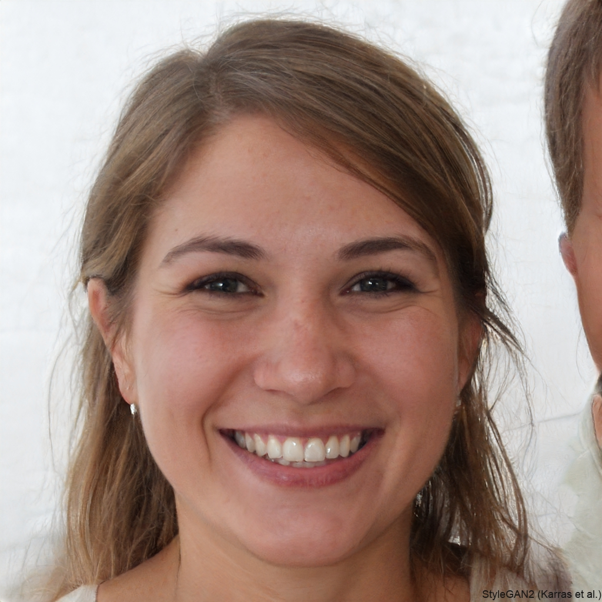

# Personas

## Introdução

As personas são personagens fictícios criados para representar usuários típicos de um sistema. Elas ajudam a manter o foco dos designers nas necessidades dos usuários durante o processo de desenvolvimento. Alan Cooper, um dos principais defensores do uso de personas, argumenta que projetar para uma única persona específica é mais eficiente do que tentar agradar a todos, pois ampliações excessivas da funcionalidade podem prejudicar a experiência geral.

## Objetivo

O objetivo das personas é garantir que as decisões de design sejam feitas considerando as necessidades e comportamentos reais dos usuários elas são usadas para representar um grupo de usuários finais de maneira clara e consistente servir como referência nas discussões de design e desenvolvimento ajudar a definir requisitos e expectativas dos usuários e orientar a criação de interfaces mais intuitivas e eficientes

## Metodologia

Com o perfil do usuário criado, temos informações e base para criar as personas. Os principais elementos que compõem uma persona incluem:
- **Identidade**: Nome, idade e características demográficas.
- **Status**: Se é uma persona primária, secundária ou uma antipersona.
- **Objetivos**: O que a persona deseja alcançar, independentemente do produto.
- **Habilidades**: Formação, experiência e competências relevantes.
- **Tarefas**: Atividades críticas e recorrentes da persona.
- **Relacionamentos**: Interações com outros stakeholders.
- **Requisitos**: Necessidades específicas da persona.
- **Expectativas**: Como a persona imagina que o sistema deve funcionar.

As personas são refinadas através de investigações sucessivas até representarem adequadamente os usuários reais. Elas são fundamentais para um design centrado no usuário, garantindo que as decisões sejam baseadas em dados concretos e não em suposições.

As imagens das personas foram geradas através do site [This person does not exist](https://thispersondoesnotexist.com/), garantindo que sejam fictícias e preservando a privacidade dos usuários reais.

## Elenco de personas

### Persona 1: Pedro Campos

|    |    |
| :----: | :---------------------: |
|  **Nome**  |   Pedro Campos   |
|  **Foto**  |    Imagem: persona 1 |
| **Descrição** | Pedro Campos, 35 anos, professor universitário de Ciência da Computação na UnB. |
| **Relacionamentos** | Colegas de departamento, alunos de disciplinas de programação, pesquisadores da área. |
| **Status**| Persona primária |
| **Informações** | Pedro é doutor em Ciência da Computação e atua na Universidade de Brasília. Ele ministra disciplinas que utilizam o CD-MOJ para avaliar estudantes em desenvolvimento de algoritmos. Ele busca maneiras de aprimorar o ensino, incentivando os alunos a resolverem desafios computacionais. |
| **Objetivos** | Utilizar uma plataforma estável e eficiente para avaliação automática de códigos e promover a prática da programação entre os alunos. |
| **Habilidades** | Alto nível de conhecimento técnico, experiência com plataformas online judges e familiaridade com metodologias de ensino para programação. |
| **Tarefas** | Criar e gerenciar listas de exercícios, acompanhar o desempenho dos alunos e corrigir provas práticas através da plataforma. |
| **Expectativas** | Espera uma interface intuitiva, relatórios detalhados sobre desempenho dos alunos e um sistema confiável para submissão de códigos. |
| **Requisitos** | Plataforma responsiva, integração com outros sistemas acadêmicos e suporte a múltiplas linguagens de programação. |

---

### Persona 2: Mariana Souza

|    |    |
| :----: | :---------------------: |
|  **Nome**  |   Mariana Souza   |
|  **Foto**  |    Imagem: persona 2 |
| **Descrição** | Mariana Souza, 21 anos, estudante de Engenharia de Software na UnB. |
| **Relacionamentos** | Colegas de curso, professores, grupos de estudos. |
| **Status**| Persona primária |
| **Informações** | Mariana é uma aluna dedicada que utiliza o CD-MOJ para praticar exercícios de disciplinas como Fundamentos de Sistema Operacionais e Estruturas de Dados. Além das atividades acadêmicas, ela também participa de competições de programação e busca constantemente melhorar suas habilidades. |
| **Objetivos** | Melhorar suas habilidades de programação resolvendo desafios variados e acompanhar seu progresso nas disciplinas. |
| **Habilidades** | Conhecimento intermediário em linguagens como Python e C, e possui experiência com outras plataformas de programação online. |
| **Tarefas** | Resolver exercícios, testar diferentes abordagens para problemas e analisar feedbacks automáticos sobre seu código. |
| **Expectativas** | Interface amigável, feedback detalhado sobre erros e desempenho, acesso rápido aos exercícios e submissões anteriores. |
| **Requisitos** | Suporte a diferentes linguagens, exemplos de entrada e saída claros e estatísticas sobre seu progresso. |

---

### Persona 3: Matheus Mendes

|    |    |
| :----: | :---------------------: |
|  **Nome**  |   Matheus Mendes   |
|  **Foto**  |    Imagem: persona 3 |
| **Descrição** | Matheus Mendes, 19 anos, estudante de Ciência da Computação recém-ingressado na UnB. |
| **Relacionamentos** | Colegas de turma, monitores das disciplinas. |
| **Status**| Persona secundária |
| **Informações** | Matheus está no primeiro semestre da graduação e tem pouca experiência com programação. Ele se sente inseguro ao resolver problemas no CD-MOJ e, muitas vezes, não entende os erros retornados pelo sistema. |
| **Objetivos** | Aprender a programar de maneira estruturada e desenvolver confiança na resolução de problemas computacionais. |
| **Habilidades** | Conhecimento básico em lógica de programação, experiência limitada com linguagens como Python. |
| **Tarefas** | Submeter exercícios, tentar interpretar mensagens de erro e buscar ajuda com monitores e colegas. |
| **Expectativas** | Um ambiente didático e acessível, com mensagens de erro compreensíveis e sugestões para aprendizado. |
| **Requisitos** | Melhor feedback nos erros de submissão, tutoriais integrados e exemplos interativos para aprendizado inicial. |

---

### Antipersona: Roberto Lima

|    |    |
| :----: | :---------------------: |
|  **Nome**  |   Roberto Lima   |
|  **Foto**  |    Imagem: persona 4 |
| **Descrição** | Roberto Lima, 40 anos, empresário no ramo de comércio eletrônico. |
| **Relacionamentos** | Equipe de TI da empresa, clientes, fornecedores. |
| **Status**| Antipersona |
| **Informações** | Roberto possui uma empresa de varejo online e precisa de um sistema para gerenciar estoques e vendas. Ele acessou o CD-MOJ por engano, esperando encontrar uma solução para suas necessidades, mas percebeu que não tem relação com seu trabalho. |
| **Objetivos** | Gerenciar sua empresa de maneira eficiente, com automação de processos. |
| **Habilidades** | Experiência com ferramentas empresariais, mas sem conhecimento em programação. |
| **Tarefas** | Acompanhar relatórios financeiros, supervisionar vendas e gerenciar equipe. |
| **Expectativas** | Sistemas voltados para o setor comercial e ferramentas de automação. |
| **Requisitos** | Plataformas de e-commerce, relatórios gerenciais e suporte a integração com ERP. |

## Referência Bibliográfica

> Barbosa, S. D. J.; Silva, B. S. da; Silveira, M. S.; Gasparini, I.; Darin, T.; Barbosa, G. D. J. (2021) Interação Humano-Computador e Experiência do usuário. Autopublicação. Capítulo 8.2 - Personas, página 153.

## Histórico de Versões

**Tabela 5** - Histórico de versões.

| Versão | Descrição          | Autor(es)                                    | Data       | Revisor(es) | Data de revisão |
|--------|--------------------|----------------------------------------------|------------|-------------|-----------------|
| 1.0    | Criação de personas | [João Vitor Santos](https://github.com/Jauzimm) | 09/02/2025 |   [Jéssica Eveline](https://github.com/xzxjesse)          |  10/02/2025               |
