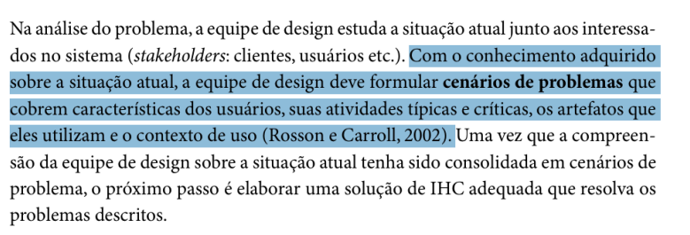
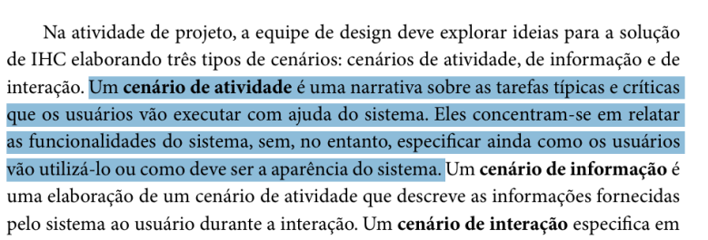

# Verificação Cenários

## Introdução

Este documento tem como objetivo apresentar a lista de verificação do artefato relacionado a Cenários.

## Lista de Vertificação

A tabela abaixo apresenta a lista de verificação do artefato de Cenários do projeto. As respostas da lista podem ser: "Conforme", "Não Conforme", "Não Aplicável" e "Sugestão de Melhoria".

**Tabela 1** - Lista de Verificação - Cenários.

| Item | Pergunta | Resposta | Versão, data e horário da avaliação | Referência |
|------|----------|----------|--------------------------------------|-------------|
| 1    | A equipe de design está considerando características dos usuários, suas atividades típicas e críticas, os artefatos utilizados e o contexto de uso na formulação dos cenários de problema? |          | 1.0, 02/02/2025 às 23:20 |  SILVA, B. S.; BARBOSA, S. D. J. Interação Humano-Computador. 1. ed. Rio de Janeiro: Editora Campus, 2010. p. 113. Capítulo 4: Processos de Design de IHC. |
| 2    | As narrativas dos cenários de atividade incluem as tarefas típicas e críticas dos usuários, sem detalhar como eles interagirão com o sistema ou sua aparência? |          | 1.0, 02/02/2025 às 23:20 |  SILVA, B. S.; BARBOSA, S. D. J. Interação Humano-Computador. 1. ed. Rio de Janeiro: Editora Campus, 2010. p. 113. Capítulo 4: Processos de Design de IHC. |
| 3    | O processo de design está sendo iterativo, permitindo revisões nas atividades previamente executadas quando necessário? |          | 1.0, 02/02/2025 às 23:20 |  SILVA, B. S.; BARBOSA, S. D. J. Interação Humano-Computador. 1. ed. Rio de Janeiro: Editora Campus, 2010. p. 113. Capítulo 4: Processos de Design de IHC. |
| 4    | O projeto possui três tipos de cenários: cenários de atividade, de informação e de interação? |          | 1.0, 02/02/2025 às 23:20 |  BARBOSA, S. D. J.; SANTANA, B. Interação Humano-Computador. 1. ed. Rio de Janeiro: Elsevier, 2010. Capítulo 4, Item 4.3.5, p. 113. |
| 5    | Os cenários possuem um enredo que inclui sequências de eventos: o que os usuários fazem, o que acontece com eles, que mudanças ocorrem no ambiente, e assim por diante? |          | 1.0, 02/02/2025 às 23:20 |  BARBOSA, S. D. J.; SANTANA, B. Interação Humano-Computador. 1. ed. Rio de Janeiro: Elsevier, 2010. Capítulo 6, Item 6.3, p. 183. |
| 6    | Os cenários possuem um ator principal e um objetivo principal? |          | 1.0, 02/02/2025 às 23:20 |  BARBOSA, S. D. J.; SANTANA, B. Interação Humano-Computador. 1. ed. Rio de Janeiro: Elsevier, 2010. Capítulo 6, Item 6.3, p. 183. |

Autor(es): [Felipe Rodrigues](https://github.com/felipeJRdev), [Jéssica Eveline](https://github.com/xzxjese), 2025.

## Referência Bibliográfica

BARBOSA, Simone Diniz Junqueira; SILVA, Bruno Santana da. *Interação Humano-Computador*. Rio de Janeiro: Elsevier, 2010.  

## Histórico de Versões

**Tabela 2** - Histórico de versões.

| Versão | Descrição | Autor(es) | Data | Revisor(es) | Data de revisão |
| :----: | :-------: | :-------: | :--: | :-------------------------------: | :-------------: |
|  1.0   | Criação do Documento | [Felipe Rodrigues](https://github.com/felipeJRdev) | 02/02/2025 | |   |