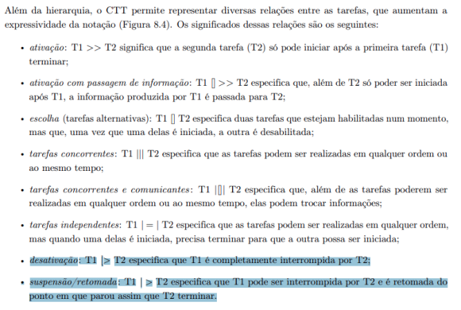

# Verificação Árvores de Tarefas Concorrentes (ConcurTaskTrees – CTT)

## Introdução

Este documento tem como objetivo apresentar a lista de verificação do artefato relacionado a Árvores de Tarefas Concorrentes (ConcurTaskTrees – CTT).

## Lista de Vertificação

A tabela abaixo apresenta a lista de verificação do artefato de Árvores de Tarefas Concorrentes (ConcurTaskTrees – CTT) do projeto. As respostas da lista podem ser: "Conforme", "Não Conforme", "Não Aplicável" e "Sugestão de Melhoria".

**Tabela 1** - Lista de Verificação - Árvores de Tarefas Concorrentes (ConcurTaskTrees – CTT).

| Item | Pergunta | Resposta | Versão, data e horário da avaliação | Referência |
|------|----------|----------|--------------------------------------|-------------|
| 1    | O modelo CTT inclui elementos que suportam o design de interação e a análise de tarefas? | Não Aplicável | 1.0, 03/02/2025 às 21:34 |  SILVA, B. S.; BARBOSA, S. D. J. Interação Humano-Computador. 1. ed. Rio de Janeiro: Editora Campus, 2010. p. 205. Capítulo 6: Organização do Espaço de Problema. |
| 2    | As 4 tarefas de CTT estão bem definidas e representadas? (Tarefas do usuário, tarefas do sistema, tarefas interativas e tarefas abstratas) | Não Aplicável | 1.0, 03/02/2025 às 21:35 |  BARBOSA, S. D. J.; SANTANA, B. Interação Humano-Computador. 1. ed. Rio de Janeiro: Elsevier, 2010. Capítulo 6, Item 6.4.3, p. 203. |
| 3    | Durante a análise de tarefas com o modelo CTT, foi considerado os diferentes tipos de tarefas (usuário, sistema, interativas e abstratas) e como elas se encaixam na hierarquia, para entender a dinâmica entre elas? | Não Aplicável | 1.0, 03/02/2025 às 21:35 |  Página 173, Capítulo 8. Organização do Espaço de Problema. Barbosa, S. D. J.; Silva, B. S. da; Silveira, M. S.; Gasparini, I.; Darin, T.; Barbosa, G. D. J. (2021) Interação Humano-Computador e Experiência do usuário. Autopublicação. |
| 4    | Ao utilizar o CTT, foi capaz de identificar e aplicar as diferentes relações entre as tarefas, como ativação, escolha e concorrência, para modelar o fluxo de trabalho de forma precisa? | Não Aplicável | 1.0, 03/02/2025 às 21:35 |  Página 173, Capítulo 8. Organização do Espaço de Problema. Barbosa, S. D. J.; Silva, B. S. da; Silveira, M. S.; Gasparini, I.; Darin, T.; Barbosa, G. D. J. (2021) Interação Humano-Computador e Experiência do usuário. Autopublicação. |
| 5    | Durante a modelagem das tarefas com o CTT, foi considerada a desativação e a suspensão/retomada de tarefas, para entender melhor como uma tarefa pode ser interrompida ou retomada em diferentes pontos do processo? | Não Aplicável | 1.0, 03/02/2025 às 21:35 |  Página 173, Capítulo 8. Organização do Espaço de Problema. Barbosa, S. D. J.; Silva, B. S. da; Silveira, M. S.; Gasparini, I.; Darin, T.; Barbosa, G. D. J. (2021) Interação Humano-Computador e Experiência do usuário. Autopublicação. |
| 6    | As tarefas apresentam explicitamente o registro de interações entre si? | Não Aplicável | 1.0, 03/02/2025 às 21:36 |  BARBOSA, Simone Diniz Junqueira; SILVA, Bruno Santana da. Interação Humano-Computador. Rio de Janeiro: Elsevier, 2010. p. 203. |
| 7    | A hierarquia das tarefas no modelo CTT está bem definida, estabelecendo corretamente a relação entre as subtarefas? | Não Aplicável | 1.0, 03/02/2025 às 21:36 |  BARBOSA, Simone Diniz Junqueira; SILVA, Bruno Santana da. Interação Humano-Computador. Rio de Janeiro: Elsevier, 2010. p. 203. |
| 8    | As relações entre tarefas no modelo CTT são devidamente especificadas e utilizadas corretamente? | Não aplicável |  1.0, 03/02/2025 às 21:37 |  BARBOSA, Simone Diniz Junqueira; SILVA, Bruno Santana da. Interação Humano-Computador. Rio de Janeiro: Elsevier, 2010. p. 203. |
 
Autor(es): [Felipe Rodrigues](https://github.com/felipeJRdev), [Jéssica Eveline](https://github.com/xzxjese), [Ruan Carvalho](https://github.com/Ruan-Carvalho), [João Vitor Santos](https://github.com/Jauzimm) e [Marcelo Adrian](https://github.com/Marcelo-Adrian), 2025.

## Referência Bibliográfica

> BARBOSA, Simone Diniz Junqueira; SILVA, Bruno Santana da. *Interação Humano-Computador*. Rio de Janeiro: Elsevier, 2010.  
> Barbosa, S. D. J.; Silva, B. S. da; Silveira, M. S.; Gasparini, I.; Darin, T.; Barbosa, G. D. J. (2021) Interação Humano-Computador e Experiência do usuário.

## Histórico de Versões

**Tabela 2** - Histórico de versões.

| Versão | Descrição | Autor(es) | Data | Revisor(es) | Data de revisão |
| :----: | :-------: | :-------: | :--: | :-------------------------------: | :-------------: |
|  1.0   | Criação do Documento | [Felipe Rodrigues](https://github.com/felipeJRdev) | 02/02/2025 | [Ruan Carvalho](https://github.com/Ruan-Carvalho), [João Vitor Santos](https://github.com/Jauzimm) e [Marcelo Adrian](https://github.com/Marcelo-Adrian) | 03/02/2025 |